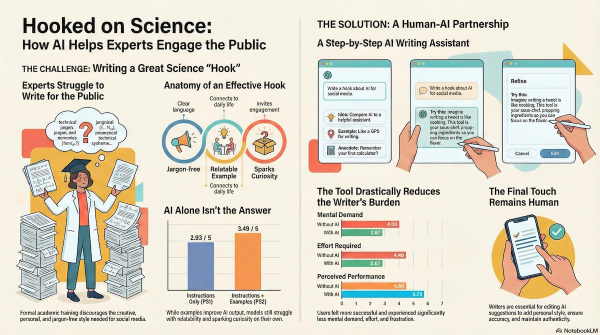
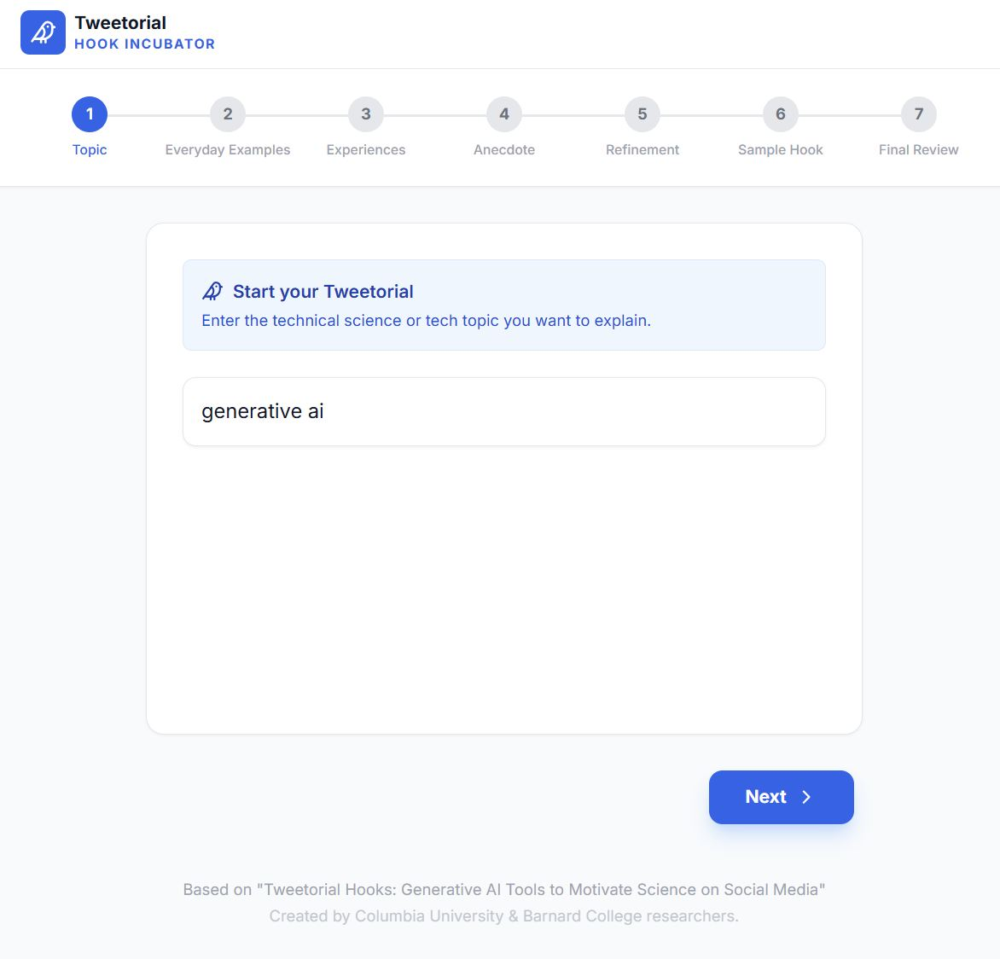
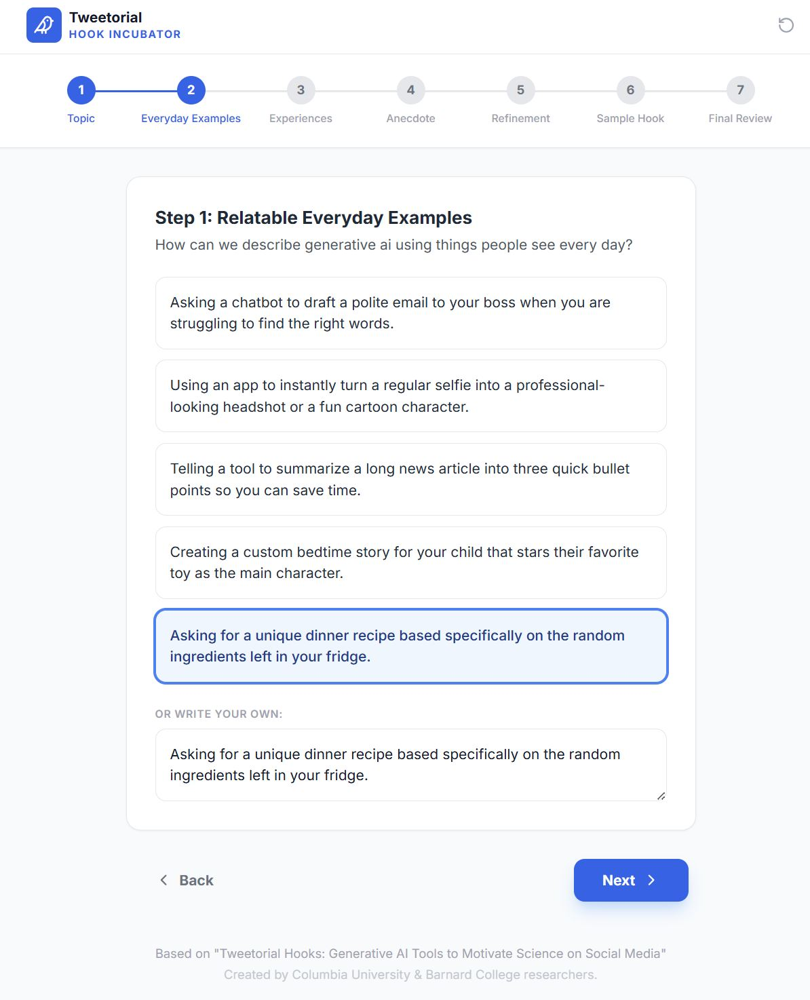
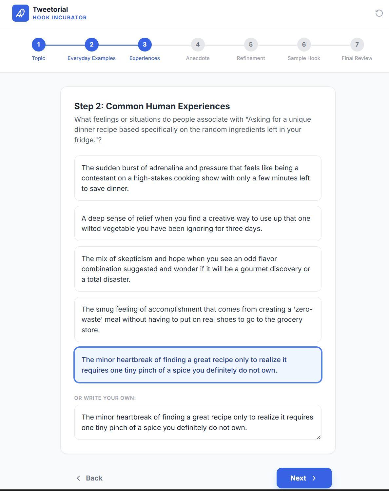
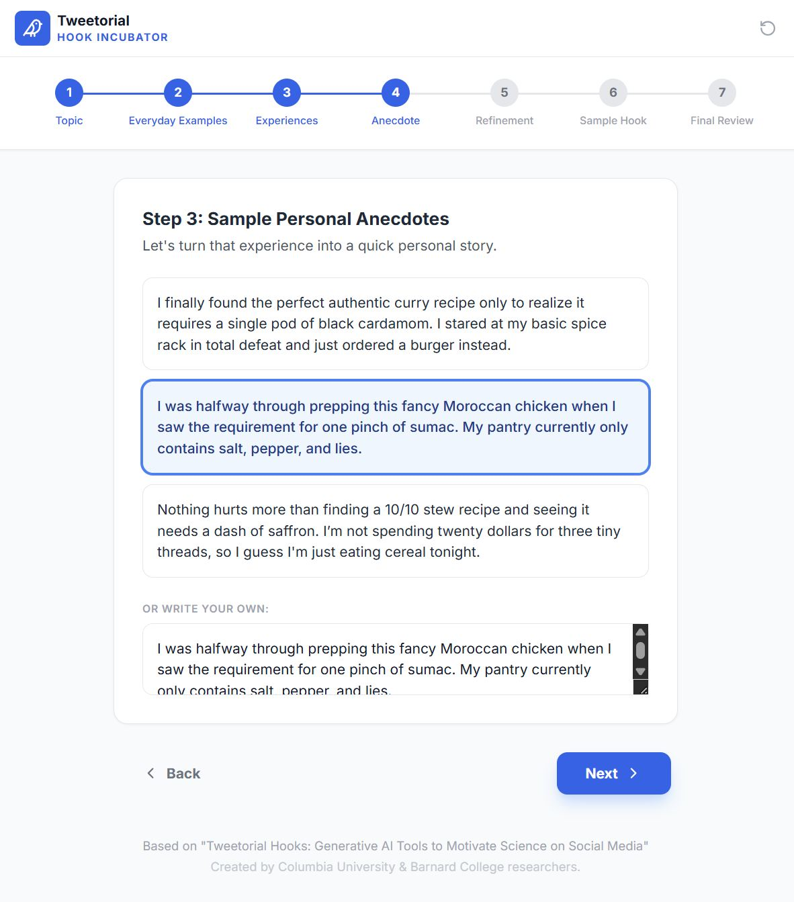
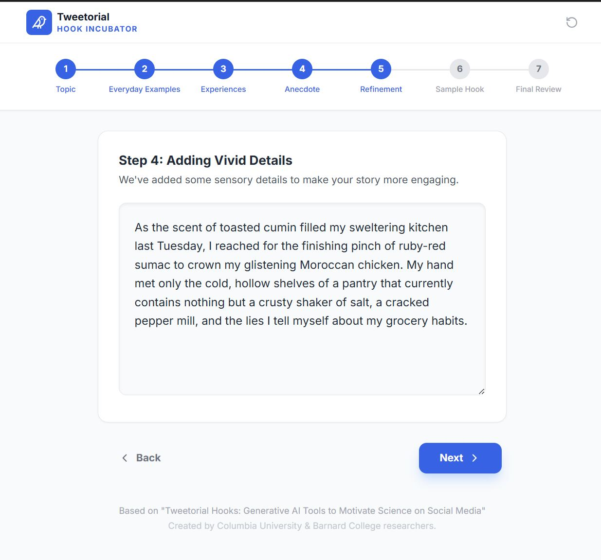
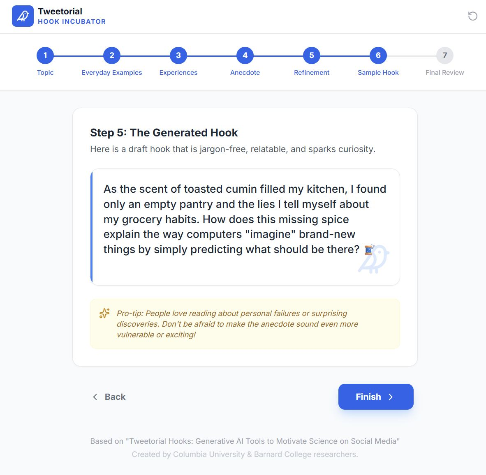
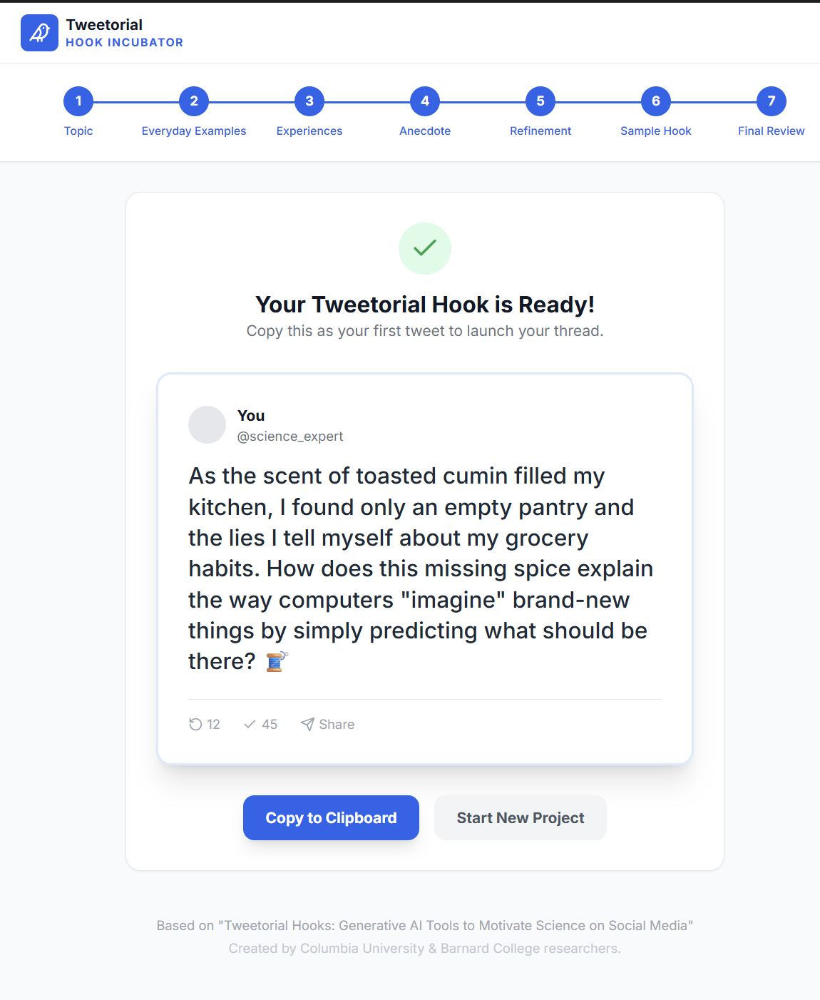

# Hooked on Science: How AI Helps Experts Engage the Public

This viral hook generator build for science technology professionals based on the white paper [Tweetorial Hooks: Generative AI Tools to Motivate Science on Social Media](https://arxiv.org/pdf/2305.12265)

## THE CHALLENGE: Writing a Great Science "Hook"

**Experts Struggle to Write for the Public**
*Formal academic training discourages the creative, personal, and jargon-free style needed for social media.*

### Anatomy of an Effective Hook
1. **Jargon-free:** Uses clear language.
2. **Relatable Example:** Connects to daily life.
3. **Sparks Curiosity:** Invites engagement.

### AI Alone Isn't the Answer
*While examples improve AI output, models still struggle with relatability and sparking curiosity on their own.*

| Method | Score (out of 5) |
| :--- | :--- |
| **Instructions Only (PS1)** | **2.93** |
| **Instructions + Examples (PS2)** | **3.49** |

---

## THE SOLUTION: A Human-AI Partnership

### A Step-by-Step AI Writing Assistant
The workflow moves through three phases:
1. **Input:** "Write a hook about AI for social media."
2. **AI Suggestions:** The tool offers variations (Idea: Compare AI to a helpful assistant / Example: Like a GPS for writing / Anecdote: Remember your first calculator?).
3. **Refine & Edit:** The writer acts as the "sous-chef," prepping ingredients so the human can focus on the flavor.

### The Tool Drastically Reduces the Writer's Burden
*Users felt more successful and experienced significantly less mental demand, effort, and frustration.*

| Metric | Without AI | With AI |
| :--- | :--- | :--- |
| **Mental Demand** | 4.00 | **2.87** |
| **Effort Required** | 4.40 | **2.67** |
| **Perceived Performance** | 4.60 | **5.73** |

### The Final Touch Remains Human
Writers are essential for editing AI suggestions to add personal style, ensure accuracy, and maintain authenticity.

***

## Screenshots

## Run Locally

**Prerequisites:**  Node.js

1. Install dependencies:
   `npm install`
2. Set the `GEMINI_API_KEY` in [.env.local](.env.local) to your Gemini API key
3. Run the app:
   `npm run dev`
